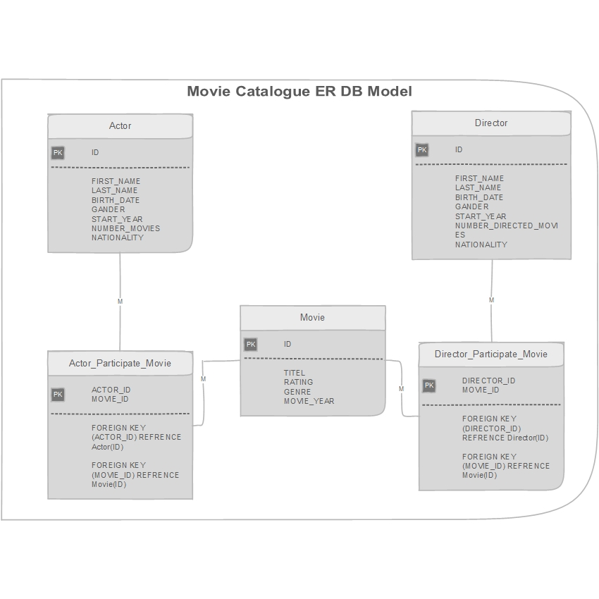
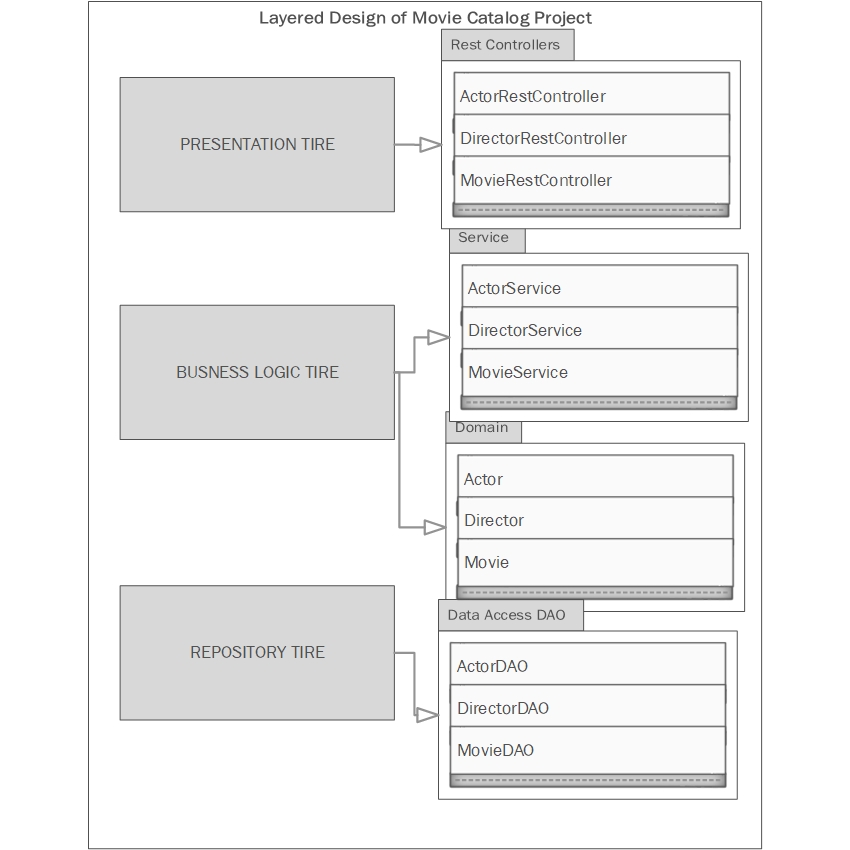
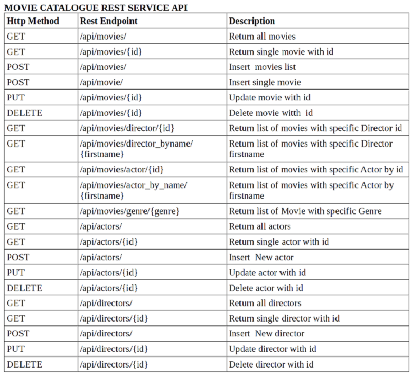

## 2- Movie Catalogue Design

### A- Database Design

the Database consists of three main Entity Tables [Movie,Actor,Director] and two Relation Mapping Tables [Actor_Participate_Movie , Director_Participate_Movie] That implements the Many-to-Many Relations.
the design as following :

   
   
### B- Business Logic Design

The design pattern considered the separation between different layers,  
- Presentation layer [her is the REST API Service Provider] 
     - using Rest Controllers.
     
- Business Logic Layer
     - using Domain Objects.
     - Service Interface and Implementation.
     
- Repository Data Access Layer 
     - using Data Access Objects DAO
     - JDPC Connection to Data base.
 
 Below are the design that separated the concern:
 
   
 
       
### C-Rest API Interface
 
 below are the set of REST Services and the associated URI.
 
   

