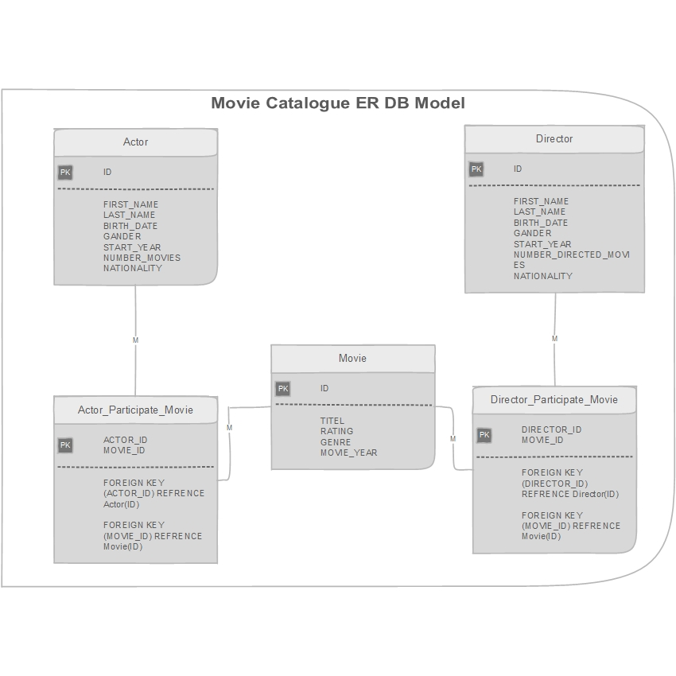
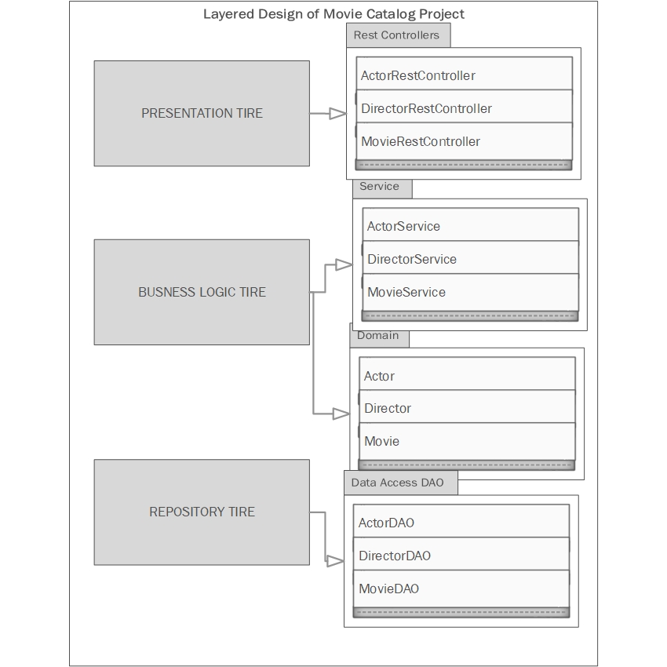
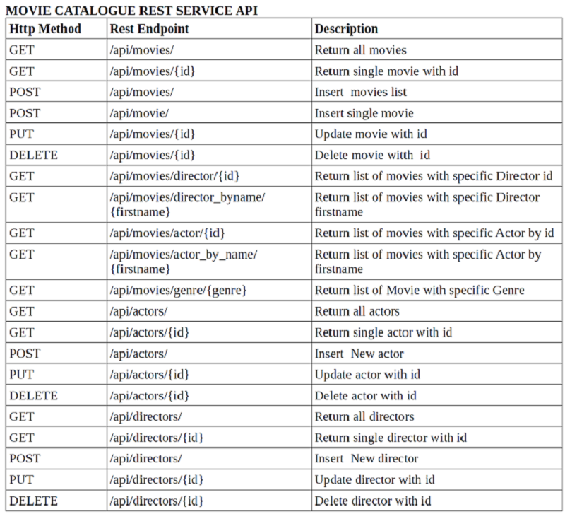
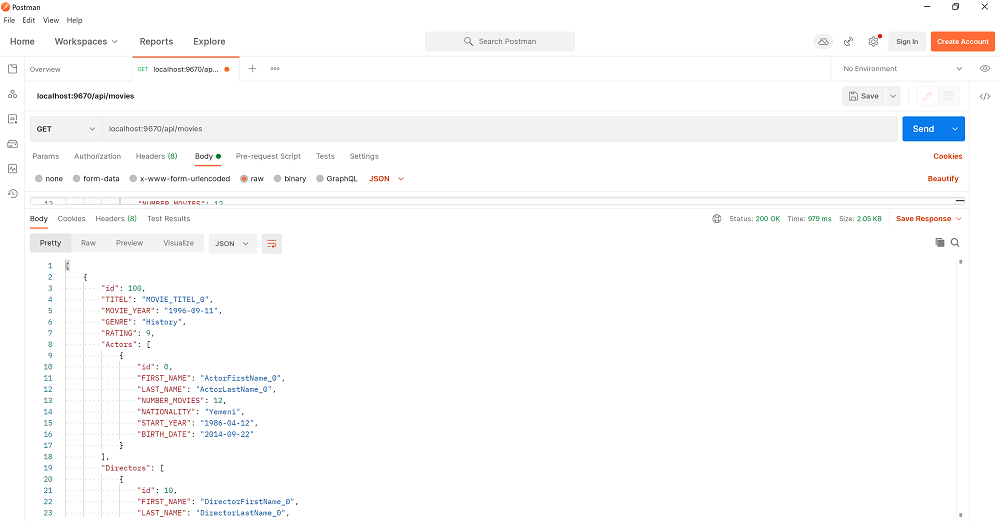
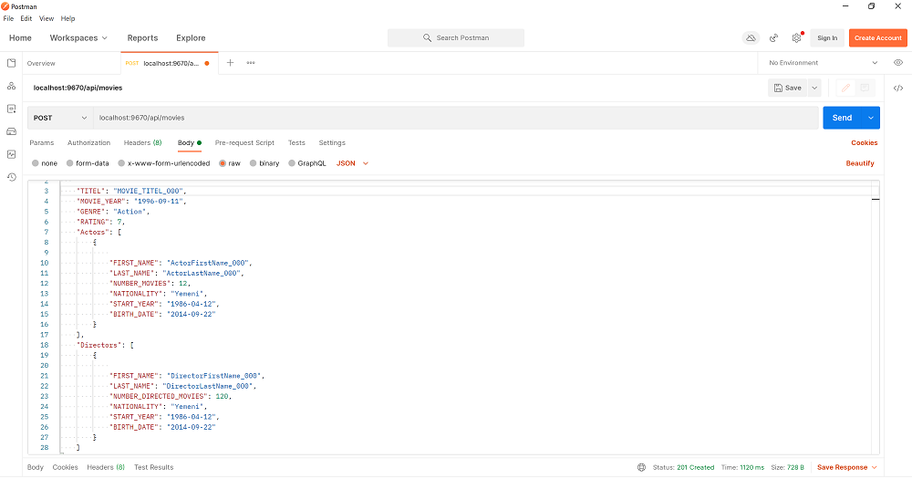

# Movie Catalogue Rest Service API
-----------
Author : Waleed Alromaema
         wal.roma@outlook.it
-----------
###Content:

1- About Movie Catalogue.

2- Movie Catalogue Design

	   a- Database Design
	   b- Business Logic Design
	   c- Rest API Interface
   
3- Runing Application

----------------
## 1- About Movie Catalogue.

movie catalogue is Microservice REST API Application developed by Spring boot Java Framework that provide the following Services:

- INSERT,UPDATE,DELETE AND QUERY ABOUT MOVIES IN CATALOGUE.
- FIND MOVIE BY ID.
- FIND MOVIE BY TITEL.  
- FIND ALL MOVIES IN THE CATALOGUE.
- FIND MOVIES BY SPESIFIC ACTOR.
- FIND MOVIES BY SPESIFIC DIRECTOR.
- FIND MOVIES BY SPESIFIC GENER.

- INSERT,UPDATE,DELETE AND QUERY ABOUT ACTORS.

- INSERT,UPDATE,DELETE AND QUERY ABOUT DIRECTORS.

## 2- Movie Catalogue Design

### A- Database Design

the Database consists of three main Entity Tables [Movie,Actor,Director] and two Relation Mapping Tables [Actor_Participate_Movie , Director_Participate_Movie] That implements the Many-to-Many Relations.
the design as following :

   

##### - database configuration

- the database used is H3(HSQLDB) database on memory Persistence.
- spring boot configured it automatically once its dependency added in the Pom.xml file.
  if  we used an on disk Persistence database we need to configure it manually in the application.proporties by configuring  spring.datasource object with database configurations.
- the database initialised by the schema.sql with in the resource directory automatically by spring boot. 
  
  


   
### B- Business Logic Design

The design pattern considered the separation between different layers,  
- Presentation layer [her is the REST API Service Provider] 
     - using Rest Controllers.
     
- Business Logic Layer
     - using Domain Objects.
     - Service Interface and Implementation.
     
- Repository Data Access Layer 
     - using Data Access Objects DAO
     - JDPC Connection to Data base.
 
 Below are the design that separated the concern:
 
   
 
       
### C-Rest API Interface
 
 below are the set of REST Services and the associated URI.
 
   

## 3- Setting and Running Application
### The tools required are: 
-  JAVA JDK 11 
-  Spring Tool Suite 4 [STS] Spring Tool Suite 4 download from https://spring.io/tools
-  POSTMAN Chrome application for client test of rest service in server side download from https://go.pstmn.io/ 
-  For list of dependencies see Pom.xml in the main project directory.

### Running the application:

#### - From STS WorkSpace:
Right click on Project from Project Explorer Pane > Run as > Spring boot app 

#### - By maven command line

```
git clone https://github.com/WaleedAlromaema/MovieCatalogueRestAPI.git
cd MovieCatalogueRestAPI
mvnw spring-boot:run
```

#### - POSTMAN

using postman for testing the Rest api service
Enter in URL: LOCALHOST:9670/api/...
as in the rest api listed above:

###here is an example of GET Movies:



her is the complete list retrieved:

           [
    {
        "id": 100,
        "TITEL": "MOVIE_TITEL_0",
        "MOVIE_YEAR": "1996-09-11",
        "GENRE": "History",
        "RATING": 9,
        "Actors": [
            {
                "id": 0,
                "FIRST_NAME": "ActorFirstName_0",
                "LAST_NAME": "ActorLastName_0",
                "NUMBER_MOVIES": 12,
                "NATIONALITY": "Yemeni",
                "START_YEAR": "1986-04-12",
                "BIRTH_DATE": "2014-09-22"
            }
        ],
        "Directors": [
            {
                "id": 10,
                "FIRST_NAME": "DirectorFirstName_0",
                "LAST_NAME": "DirectorLastName_0",
                "NUMBER_DIRECTED_MOVIES": 120,
                "NATIONALITY": "Yemeni",
                "START_YEAR": "1986-04-12",
                "BIRTH_DATE": "2014-09-22"
            }
        ]
    },
    {
        "id": 200,
        "TITEL": "MOVIE_TITEL_1",
        "MOVIE_YEAR": "1996-09-11",
        "GENRE": "Advanture",
        "RATING": 8,
        "Actors": [
            {
                "id": 1,
                "FIRST_NAME": "ActorFirstName_1",
                "LAST_NAME": "ActorLastName_1",
                "NUMBER_MOVIES": 12,
                "NATIONALITY": "Yemeni",
                "START_YEAR": "1986-04-12",
                "BIRTH_DATE": "2014-09-22"
            }
        ],
        "Directors": [
            {
                "id": 20,
                "FIRST_NAME": "DirectorFirstName_1",
                "LAST_NAME": "DirectorLastName_1",
                "NUMBER_DIRECTED_MOVIES": 120,
                "NATIONALITY": "Yemeni",
                "START_YEAR": "1986-04-12",
                "BIRTH_DATE": "2014-09-22"
            }
        ]
    },
    {
        "id": 300,
        "TITEL": "MOVIE_TITEL_2",
        "MOVIE_YEAR": "1996-09-11",
        "GENRE": "Action",
        "RATING": 7,
        "Actors": [
            {
                "id": 2,
                "FIRST_NAME": "ActorFirstName_2",
                "LAST_NAME": "ActorLastName_2",
                "NUMBER_MOVIES": 12,
                "NATIONALITY": "Yemeni",
                "START_YEAR": "1986-04-12",
                "BIRTH_DATE": "2014-09-22"
            }
        ],
        "Directors": [
            {
                "id": 30,
                "FIRST_NAME": "DirectorFirstName_2",
                "LAST_NAME": "DirectorLastName_2",
                "NUMBER_DIRECTED_MOVIES": 120,
                "NATIONALITY": "Yemeni",
                "START_YEAR": "1986-04-12",
                "BIRTH_DATE": "2014-09-22"
            }
        ]
    },
    {
        "id": 400,
        "TITEL": "MOVIE_TITEL_3",
        "MOVIE_YEAR": "1996-09-11",
        "GENRE": "Romantic",
        "RATING": 3,
        "Actors": [
            {
                "id": 3,
                "FIRST_NAME": "ActorFirstName_3",
                "LAST_NAME": "ActorLastName_3",
                "NUMBER_MOVIES": 12,
                "NATIONALITY": "Yemeni",
                "START_YEAR": "1986-04-12",
                "BIRTH_DATE": "2014-09-22"
            }
        ],
        "Directors": [
            {
                "id": 40,
                "FIRST_NAME": "DirectorFirstName_3",
                "LAST_NAME": "DirectorLastName_3",
                "NUMBER_DIRECTED_MOVIES": 120,
                "NATIONALITY": "Yemeni",
                "START_YEAR": "1986-04-12",
                "BIRTH_DATE": "2014-09-22"
            }
        ]
    },
    {
        "id": 401,
        "TITEL": "MOVIE_TITEL_000",
        "MOVIE_YEAR": "1996-09-11",
        "GENRE": "Action",
        "RATING": 7,
        "Actors": [
            {
                "id": 4,
                "FIRST_NAME": "ActorFirstName_000",
                "LAST_NAME": "ActorLastName_000",
                "NUMBER_MOVIES": 12,
                "NATIONALITY": "Yemeni",
                "START_YEAR": "2014-09-22",
                "BIRTH_DATE": "1986-04-12"
            }
        ],
        "Directors": [
            {
                "id": 41,
                "FIRST_NAME": "DirectorFirstName_000",
                "LAST_NAME": "DirectorLastName_000",
                "NUMBER_DIRECTED_MOVIES": 120,
                "NATIONALITY": "Yemeni",
                "START_YEAR": "2014-09-22",
                "BIRTH_DATE": "1986-04-12"
            }
        ]
    }
]

### Example of insert movie :



The same applied for The rest of API List of Actors and Directors.

