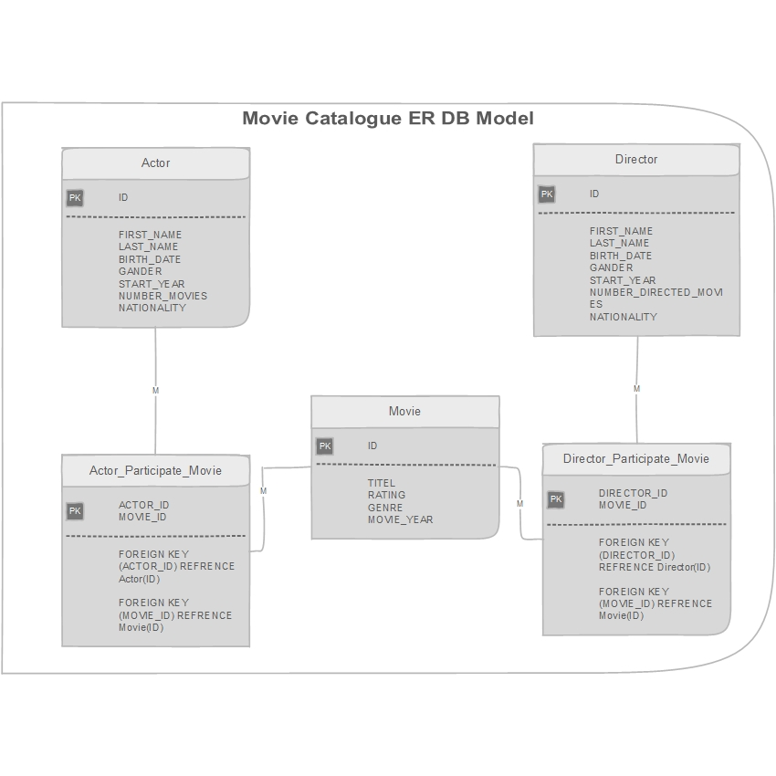

# Movie Catalogue Rest Service API
-----------
Author : Waleed Alromaema
         wal.roma@outlook.it
-----------
###Content:

1- About Movie Catalogue.

2- Movie Catalogue Design

	   a- Database Design
	   b- Business Logic Design
	   c- Rest API Interface
   
3- Runing Application

----------------
## 1- About Movie Catalogue.

movie catalogue is Microservice REST API Application that provide the following Services:

- INSERT,UPDATE,DELETE AND QUERY ABOUT MOVIES IN CATALOGUE.
- FIND MOVIE BY ID.
- FIND MOVIE BY TITEL.  
- FIND ALL MOVIES IN THE CATALOGUE.
- FIND MOVIES BY SPESIFIC ACTOR.
- FIND MOVIES BY SPESIFIC DIRECTOR.
- FIND MOVIES BY SPESIFIC GENER.

- INSERT,UPDATE,DELETE AND QUERY ABOUT ACTORS.

- INSERT,UPDATE,DELETE AND QUERY ABOUT DIRECTORS.

## 2- Movie Catalogue Design

### A- Database Design

the Database consists of three main Entity Tables [Movie,Actor,Director] and two Relation Mapping Tables [Actor_Participate_Movie , Director_Participate_Movie] That implements the Many-to-Many Relations.
the design as following :

   
   
### B- Business Logic Design

The design pattern considered the separation between different layers,  
- Presentation layer [her is the REST API Service Provider] 
     - using Rest Controllers.
     
- Business Logic Layer
     - using Domain Objects.
     - Service Interface and Implementation.
     
- Repository Data Access Layer 
     - using Data Access Objects DAO
     - JDPC Connection to Data base.
 
 Below are the design that separated the concern:
 
   
 
       
### C-Rest API Interface
 
 below are the set of REST Services and the associated URI.
 
   

## 3- Setting and Running Application
### The tools required are: 
-  JAVA JDK 11 
-  Spring Tool Suite 4 [STS] Spring Tool Suite 4 download from https://spring.io/tools
-  POSTMAN Chrome application for client test of rest service in server side download from https://go.pstmn.io/ 
-  For list of dependencies see Pom.xml in the main project directory.

### Running the application:

#### - From STS WorkSpace:
Right click on Project from Project Explorer Pane > Run as > Spring boot app 

#### - POSTMAN

using postman for testing the Rest api service
Enter in URL: LOCALHOST:9670/api/...
as in the rest api listed above:

###here is an example of GET Movies:

her is the complete list retrieved:

           [
    {
        "id": 10,
        "TITEL": "TITANIC 1996",
        "MOVIE_YEAR": "1996-09-11",
        "GENRE": "Romantic",
        "RATING": 9,
        "Actors": [
            {
                "id": 100,
                "FIRST_NAME": "Waleed100",
                "LAST_NAME": "Alromaema100",
                "NUMBER_MOVIES": 12,
                "NATIONALITY": "Yemeni",
                "START_YEAR": "1986-04-12",
                "BIRTH_DATE": "2014-09-22"
            }
        ],
        "Directors": [
            {
                "id": 1000,
                "FIRST_NAME": "DirWaleed100",
                "LAST_NAME": "DirAlromaema100",
                "NUMBER_DIRECTED_MOVIES": 120,
                "NATIONALITY": "Yemeni",
                "START_YEAR": "1986-04-12",
                "BIRTH_DATE": "2014-09-22"
            }
        ]
    },
    {
        "id": 20,
        "TITEL": "TITANIC 2000",
        "MOVIE_YEAR": "1996-09-11",
        "GENRE": "Romantic",
        "RATING": 8,
        "Actors": [
            {
                "id": 200,
                "FIRST_NAME": "Waleed200",
                "LAST_NAME": "Alromaema200",
                "NUMBER_MOVIES": 12,
                "NATIONALITY": "Yemeni",
                "START_YEAR": "1986-04-12",
                "BIRTH_DATE": "2014-09-22"
            }
        ],
        "Directors": [
            {
                "id": 2000,
                "FIRST_NAME": "DirWaleed200",
                "LAST_NAME": "DirAlromaema200",
                "NUMBER_DIRECTED_MOVIES": 120,
                "NATIONALITY": "Yemeni",
                "START_YEAR": "1986-04-12",
                "BIRTH_DATE": "2014-09-22"
            }
        ]
    },
    {
        "id": 30,
        "TITEL": "TITANIC 2015",
        "MOVIE_YEAR": "1996-09-11",
        "GENRE": "Romantic",
        "RATING": 7,
        "Actors": [
            {
                "id": 300,
                "FIRST_NAME": "Waleed300",
                "LAST_NAME": "Alromaema300",
                "NUMBER_MOVIES": 12,
                "NATIONALITY": "Yemeni",
                "START_YEAR": "1986-04-12",
                "BIRTH_DATE": "2014-09-22"
            }
        ],
        "Directors": [
            {
                "id": 3000,
                "FIRST_NAME": "DirWaleed300",
                "LAST_NAME": "DirAlromaema300",
                "NUMBER_DIRECTED_MOVIES": 120,
                "NATIONALITY": "Yemeni",
                "START_YEAR": "1986-04-12",
                "BIRTH_DATE": "2014-09-22"
            }
        ]
    },
    {
        "id": 40,
        "TITEL": "TITANIC 2021",
        "MOVIE_YEAR": "1996-09-11",
        "GENRE": "Romantic",
        "RATING": 3,
        "Actors": [
            {
                "id": 400,
                "FIRST_NAME": "Waleed400",
                "LAST_NAME": "Alromaema400",
                "NUMBER_MOVIES": 12,
                "NATIONALITY": "Yemeni",
                "START_YEAR": "1986-04-12",
                "BIRTH_DATE": "2014-09-22"
            }
        ],
        "Directors": [
            {
                "id": 4000,
                "FIRST_NAME": "DirWaleed400",
                "LAST_NAME": "DirAlromaema400",
                "NUMBER_DIRECTED_MOVIES": 120,
                "NATIONALITY": "Yemeni",
                "START_YEAR": "1986-04-12",
                "BIRTH_DATE": "2014-09-22"
            }
        ]
    },
    {
        "id": 41,
        "TITEL": "TITANIC 489",
        "MOVIE_YEAR": "1996-09-11",
        "GENRE": "Romantic",
        "RATING": 9,
        "Actors": [
            {
                "id": 402,
                "FIRST_NAME": "Waleed150",
                "LAST_NAME": "Alromaema150",
                "NUMBER_MOVIES": 12,
                "NATIONALITY": "Yemeni",
                "START_YEAR": "2014-09-22",
                "BIRTH_DATE": "1986-04-12"
            }
        ],
        "Directors": [
            {
                "id": 4001,
                "FIRST_NAME": "DirWaleed990",
                "LAST_NAME": "DirAlromaema990",
                "NUMBER_DIRECTED_MOVIES": 120,
                "NATIONALITY": "Yemeni",
                "START_YEAR": "2014-09-22",
                "BIRTH_DATE": "1986-04-12"
            }
        ]
    }
]

### Example of insert movie :

The same applied for The rest of API List of ACtors and Directors.

